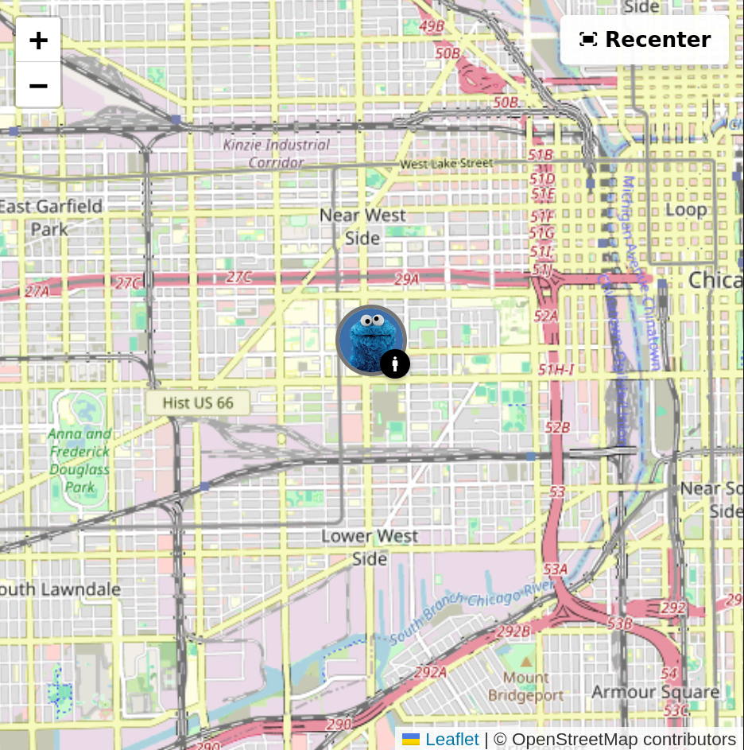
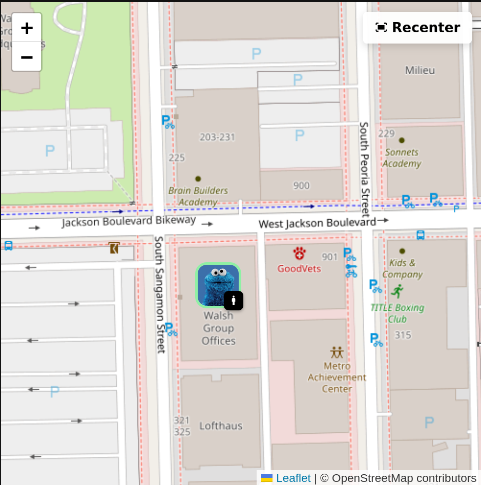
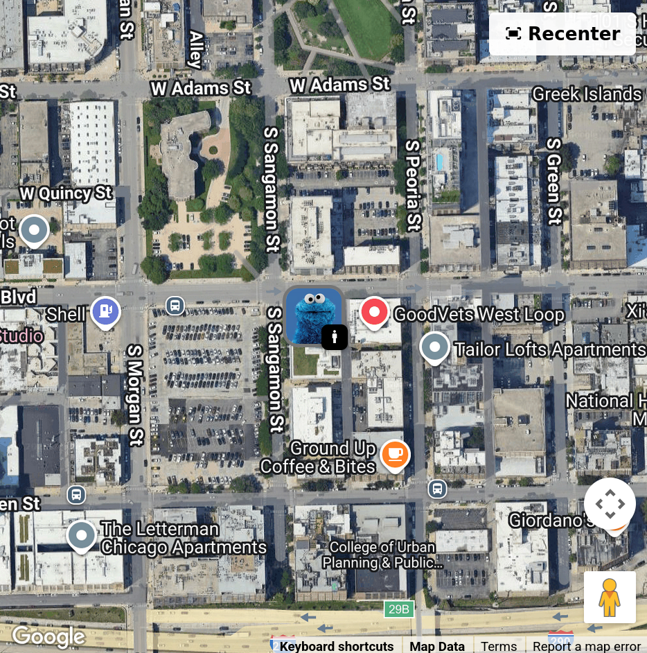
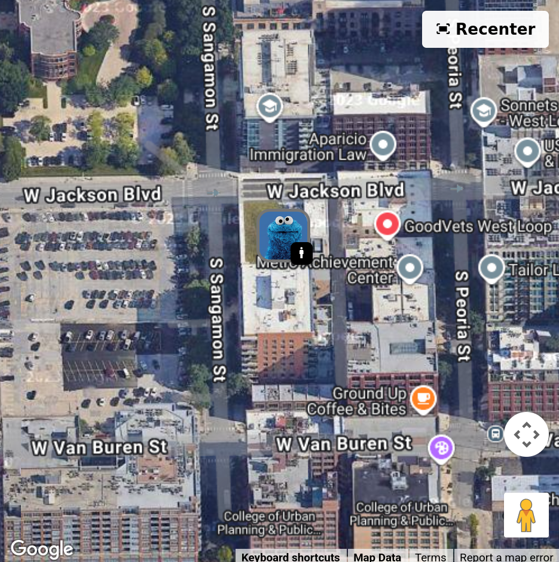

# Map Badge Card for Home Assistant

A custom card that shows person locations on a map with profile pictures and activity badges.




## Features

- OpenStreetMap (free) or Google Maps
- Profile pictures as map markers with colored borders based on zones
- Activity badges (walking, driving, etc.) from your phone's sensors
- Customizable colors and border styles

### Zone-based Markers



Markers show colored borders based on zones (home = green, away = gray, etc.)

### Google Maps Support

<table>
  <tr>
    <td></td>
    <td></td>
  </tr>
  <tr>
    <td align="center">Standard view</td>
    <td align="center">3D tilt at high zoom</td>
  </tr>
</table>

## Installation

### HACS (Recommended)

_Coming soon_

### Manual Installation

1. Download `map-badge-card.js` and `map-badge-v2.html`
2. Create a folder `/config/www/map-badge-card/`
3. Copy both files into that folder
4. Add the card resource:
   - Go to Settings → Dashboards → Resources
   - Click "Add Resource"
   - URL: `/local/map-badge-card/map-badge-card.js`
   - Resource type: `JavaScript Module`
5. Refresh your browser

## Configuration

### Basic Configuration

```yaml
type: custom:map-badge-card
entities:
  - person: person.john
    activity: sensor.john_phone_activity
  - person: person.jane
    activity: sensor.jane_phone_activity
map_provider: osm  # or 'google'
default_zoom: 13
update_interval: 10  # seconds
```

### Full Configuration Example

```yaml
type: custom:map-badge-card
entities:
  - person: person.john
    activity: sensor.john_phone_activity
  - person: person.jane
    activity: sensor.jane_phone_activity
map_provider: google
google_api_key: YOUR_GOOGLE_API_KEY
map_type: hybrid  # hybrid, satellite, roadmap, or terrain
default_zoom: 15
update_interval: 10
marker_border_radius: 50%  # 50% for circles, or use px (e.g., 8px)
badge_border_radius: 50%
debug: false
zones:
  home:
    color: '#cef595'
  not_home:
    color: '#757575'
  work:
    color: '#4285f4'
activities:
  still:
    color: '#000000'
  walking:
    color: '#4caf50'
  running:
    color: '#ff5722'
  on_bicycle:
    color: '#2196f3'
  in_vehicle:
    color: '#9c27b0'
```

## Configuration Options

| Option | Type | Default | Description |
|--------|------|---------|-------------|
| `entities` | list | **Required** | List of person entities with optional activity sensors |
| `map_provider` | string | `osm` | Map provider: `osm` (OpenStreetMap) or `google` |
| `google_api_key` | string | - | Google Maps API key (required only for Google Maps) |
| `map_type` | string | `hybrid` | Google Maps type: `hybrid`, `satellite`, `roadmap`, or `terrain` |
| `default_zoom` | number | `13` | Initial map zoom level (1-21) |
| `update_interval` | number | `10` | Update interval in seconds |
| `marker_border_radius` | string | `50%` | Border radius for profile pictures |
| `badge_border_radius` | string | `50%` | Border radius for activity badges |
| `debug` | boolean | `false` | Enable debug mode for troubleshooting |
| `zones` | object | See below | Custom zone configurations |
| `activities` | object | See below | Custom activity color configurations |

### Supported Activities

Based on [Google](https://developers.google.com/android/reference/com/google/android/gms/location/DetectedActivity) and iOS activity detection APIs. Icons are fixed, you can only change colors.

- Still, On Foot, Walking, Running, Cycling
- In Vehicle (covers car, automotive, etc.)
- On Train, On Bus
- Tilting

All default to black background with white icons.

## Requirements

Your person entities need GPS coordinates (latitude/longitude) and profile pictures. Activity sensors come from the [Home Assistant Companion App](https://companion.home-assistant.io/) or similar integrations.

For Google Maps, you'll need an API key from [Google Cloud Console](https://console.cloud.google.com/) with billing enabled. OpenStreetMap works out of the box.
